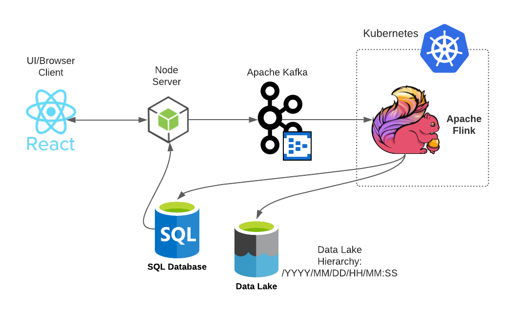

# Bulk Image Upload
Working Demo: https://image-repo-ui.azurewebsites.net/

Streams and uploads unique images out of large set for every 30 seconds tumbling window using Apache Flink, Apache Kafka (Azure Event Hub), Data Lake (ADLS). Saves upload summary in a Microsoft SQL Database (Azure SQL) for every window and displays it in React UI with a image upload form.

## Architecture

## Explanation
- React UI
  - User selectS one or more images at once (each image should be less than 300kb). These images are sent to Node API. 
  - Fetches latest upload summary every 10 seconds from SQL database via Node server.
- Node Server
   - Provides POST API for React to post images. 
   - Posted images are pushed in batch into the Apache Kafka topic.
   - Provides GET API for fetching upload summary for every 30 second of time window.
- Kafka (Azure Event hub)
   - Provides a topic to stream images.
- Flink + Kubernetes
   - Pulls images from Apache Kafka topic.
   - Irrespective of image names, finds unique images by checking content and maintains count. Does this aggregation for every 30 second tumbling window.
   - Uploads these images in Data Lake (Azure Data Lake Gen 2).
   - Inserts these 30 second upload summary (Image name, count, Data lake URL, time) in SQL database.
- Data Lake
   - Directory structure is in the form of YYYY/MM/DD/HH/MM:SS. So that images are organized based on time.
   - URL of accessing each uploaded image is saved in SQL database for upload summary in UI.
- SQL 
   - Has a table `UploadSummary` which contains FileName, Count, Url for accessing this image, Time. This table is displayed in UI below the form.
## How to bootstrap
### Modify code
- React UI
  - Update Node server URL (`baseUrl` value) in client/api.js
- Node server

   In server/app.js:
  - Update Kafka endpoint URL (`brokers`)
  - Update Kafka `username`, `password`, `topicName`.
  - Update `sqlConnectionString`
- Flink
  - In flink/src/main/java/com/flink/app/Upload.java - Update Kafka topic in `CONSUMER_TOPIC`, Datalake container account key, account name and container name in `ACCOUNT_KEY`, `ACCOUNT_NAME`, and `CONTAINER_NAME` respectively.
  - In flink/src/main/resources/database.properties - Update jdbc connection string in `url` and Kafka `user`, `password`.
  - In flink/src/main/resources/Kafka.properties - Update Kafka endpoint URL in `url` and Kafka `user`, `password`.
- Kubernetes:
  - In flink/kubernetes/flink-configuration-config.yaml: Update Kafka properties like `bootstrap.servers`, Kafka username, password in `sasl.jaas.config`. Update database properties like jdbc connection string in `url` and `user`, `password`.
### Setup, Install, Deploy
- React UI
  - `npm run build` to create a production build, and `serve -s build` to run this build. `npm start` to run dev build.
- Node
  - `npm start` to run.
- Flink

  For local:
  - Setup flink cluster, follow [this](https://nightlies.apache.org/flink/flink-docs-release-1.14/docs/try-flink/local_installation/). I used Flink 1.12 scala 2.11 Java 11 based version.
  - `mvn clean install -Pbuild-jar` to create a jar. This jar will be generated as flink/target/flink-upload-1.0-SNAPSHOT.jar. Deploy this jar in your cluster. If you're new for deploying, you can check [this](https://nightlies.apache.org/flink/flink-docs-master/docs/try-flink/local_installation/) beginner example.

  For Cloud:
  - If you're new, you can read [this](https://towardsdatascience.com/running-apache-flink-with-rocksdb-on-azure-kubernetes-service-904181d79f72) to deploy Apache Flink on a Kubernetes cluster. I have provided all YAML files in flink/kubernetes folder.
- Kafka
  - Create Kafka cluster or endpoint (I used Azure Event Hub) and created a topic in it. Provided YAML template.
- Data Lake
  - Create a data lake and a container inside it (I used Azure Data Lake Gen 2) to store images. Provided YAML template.

## Things to do
- Unit test cases
- Logging
- Partitioning in Kafka Topic
- Parallelism in Flink service
- Managed identity or token based authentication
- CI/CD Automation
- Typescript